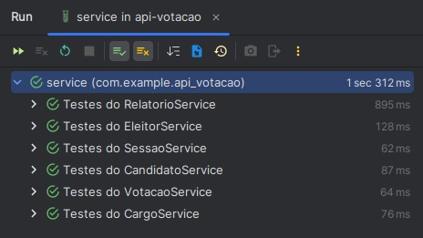
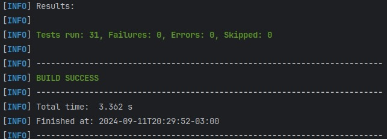
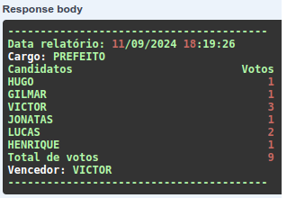

<p align="center"> 💻 Atualizado em 11 de Setembro de 2024 💻</p>

<h1 align="center"> 📟 Desafio API-Votação 📟</h1>

<p align="center">
  

  

  <a href="https://github.com/gabrielcoelhox/course-angular-java/commits/main">
    
  </a>
</p>

[O Projeto](#id1)&nbsp;&nbsp;&nbsp;|&nbsp;&nbsp;&nbsp;
[Como executar o projeto](#id2)&nbsp;&nbsp;&nbsp;|&nbsp;&nbsp;&nbsp;
[Regra de negócio](#id3)&nbsp;&nbsp;&nbsp;|&nbsp;&nbsp;&nbsp;
[Recursos/End-points](#id4)&nbsp;&nbsp;&nbsp;|&nbsp;&nbsp;&nbsp;
[Demonstração](#id5)&nbsp;&nbsp;&nbsp;|&nbsp;&nbsp;&nbsp;

## <a id="id1"> 💻 O Projeto </a>

Este projeto foi desenvolvido como desafio de avaliação para a vaga de desenvolvedor da empresa __*Lifters*__. A proposta do projeto é implementar uma pequena API, que permita cadastro básico dos candidatos, eleitores, dos votos e relatório para identificar a quantidade de votos para cada candidato e o vencedor.

## <a id="id2">:hammer_and_wrench: Como executar o projeto </a>

### Pré-requisitos

Antes de começar, você vai precisar ter instalado em sua máquina as seguintes ferramentas:
- [Git](https://git-scm.com);
- [Java JDK - __*VERSÃO 17+*__][Java JDK];
- IDE de sua escolha;

<details>
<summary><strong>Rodando o projeto</strong></summary>

```bash
# Clone este repositório
$ git clone https://github.com/gabrielcoelhox/api-votacao.git
# Abra o projeto na IDE de sua escolha
$ Inicie o projeto utilizando o comando mvn spring-boot:run
# Aguarde até o projeto ser completemante buildado
$ Acesse o site do Swagger http://localhost:8080/swagger-ui
```
</details>

<details>
<summary><strong>Rodando os testes</strong></summary>

Rode o comando __*mvn test*__

Resultados:




</details>

## <a id="id3"> 📝 Regras de negócio </a>

1. Validar para permitir apenas um voto por eleitor;
2. Validar para não permitir candidatos e eleitores duplicados;
3. Caso algum candidato ou eleitor já possua um voto, este não poderá ser apagado, ou seja, só permitir apagar caso ele ainda não tenha nenhum voto computado;
4. Só será possível realizar a votação quando a sessão estiver aberta e consequentemente não poderá ser encerrada caso não esteja aberta;
5. Uma sessão pode ser iniciada e encerrada sem um tempo entre elas, contanto que seja respeitada a regra no4;
6. A sessão só poderá ser encerrada caso haja 0 votos ou pelo menos 2 votos, pois garante a anonimidade dos votantes. Entretanto, caso apenas um eleitor tenha votado e seja necessário encerrar a sessão, o voto desse eleitor deverá ser desconsiderado na contabilização e consequentemente não haverá candidato vencedor;
7. Deverá ser possível gerar um Boletim de Urna, que é um relatório com o resultado de cada sessão;
8. Caso durante a geração do boletim de urna haja apenas um votante, a regra num 6 deverá ser mantida e não haverá contabilização ou vencedor;
9. O relatório poderá ser gerado apenas de sessões encerradas, portanto é necessário chamar o endpoint de encerrar sessão para que o relatório esteja disponível para geração;
10. O boletim de urna tem um layout específico de 40 colunas por linha. Um exemplo pode ser visto no retorno do endpoint GET /boletim-urna/{idSessao}.

## <a id="id4"> 📍 Recursos/End-points </a>

- CRUD para /candidatos
- CRUD para /eleitores
- CRUD para /cargos
- POST /abrir-sessao
- PATCH /fechar-sessao
- POST /eleitores/{id}/votar
- GET /boletim-urna/{idSessao}

## <a id="id5"> 🖼️ Demonstração </a>

### Eleitores
<details>
<summary><strong>Ver mais</strong></summary>

```bash
[
  {
    "nome": "VINICIUS"
  },
  {
    "nome": "MATHEUS"
  },
  {
    "nome": "GABRIEL"
  },
  {
    "nome": "LUAN"
  },
  {
    "nome": "CAIO"
  },
  {
    "nome": "RENATO"
  },
  {
    "nome": "JOAO"
  },
  {
    "nome": "SILVIO"
  },
  {
    "nome": "BRUNO"
  },
  {
    "nome": "BRENO"
  }
]
```
</details>

### Lista de candidatos
<details>
<summary><strong>Ver mais</strong></summary>

```bash
[
  {
    "nome": "LUCAS"
  },
  {
    "nome": "GILMAR"
  },
  {
    "nome": "VICTOR"
  },
  {
    "nome": "JONATAS"
  },
  {
    "nome": "HENRIQUE"
  },
  {
    "nome": "HUGO"
  }
]
```
</details>

### Cargos
<details>
<summary><strong>Ver mais</strong></summary>

```bash
[
  {
    "nome": "PREFEITO"
  }
]
```
</details>

### Votos
<details>
<summary><strong>Ver mais</strong></summary>

```bash
[
  {
    "id": 1,
    "candidato": {
      "nome": "GILMAR"
    },
    "eleitor": {
      "nome": "VINICIUS"
    },
    "sessao": {
      "id": 1,
      "inicio": "2024-09-11T18:16:35.546656",
      "fim": null,
      "aberta": true
    }
  },
  {
    "id": 2,
    "candidato": {
      "nome": "LUCAS"
    },
    "eleitor": {
      "nome": "MATHEUS"
    },
    "sessao": {
      "id": 1,
      "inicio": "2024-09-11T18:16:35.546656",
      "fim": null,
      "aberta": true
    }
  },
  {
    "id": 3,
    "candidato": {
      "nome": "VICTOR"
    },
    "eleitor": {
      "nome": "GABRIEL"
    },
    "sessao": {
      "id": 1,
      "inicio": "2024-09-11T18:16:35.546656",
      "fim": null,
      "aberta": true
    }
  },
  {
    "id": 4,
    "candidato": {
      "nome": "VICTOR"
    },
    "eleitor": {
      "nome": "LUAN"
    },
    "sessao": {
      "id": 1,
      "inicio": "2024-09-11T18:16:35.546656",
      "fim": null,
      "aberta": true
    }
  },
  {
    "id": 5,
    "candidato": {
      "nome": "VICTOR"
    },
    "eleitor": {
      "nome": "CAIO"
    },
    "sessao": {
      "id": 1,
      "inicio": "2024-09-11T18:16:35.546656",
      "fim": null,
      "aberta": true
    }
  },
  {
    "id": 6,
    "candidato": {
      "nome": "JONATAS"
    },
    "eleitor": {
      "nome": "RENATO"
    },
    "sessao": {
      "id": 1,
      "inicio": "2024-09-11T18:16:35.546656",
      "fim": null,
      "aberta": true
    }
  },
  {
    "id": 7,
    "candidato": {
      "nome": "HENRIQUE"
    },
    "eleitor": {
      "nome": "JOAO"
    },
    "sessao": {
      "id": 1,
      "inicio": "2024-09-11T18:16:35.546656",
      "fim": null,
      "aberta": true
    }
  },
  {
    "id": 8,
    "candidato": {
      "nome": "HUGO"
    },
    "eleitor": {
      "nome": "SILVIO"
    },
    "sessao": {
      "id": 1,
      "inicio": "2024-09-11T18:16:35.546656",
      "fim": null,
      "aberta": true
    }
  },
  {
    "id": 9,
    "candidato": {
      "nome": "LUCAS"
    },
    "eleitor": {
      "nome": "BRUNO"
    },
    "sessao": {
      "id": 1,
      "inicio": "2024-09-11T18:16:35.546656",
      "fim": null,
      "aberta": true
    }
  }
]
```
</details>

### Sessão Fechada
<details>
<summary><strong>Ver mais</strong></summary>

```bash
{
  "id": 1,
  "inicio": "2024-09-11T18:16:35.546656",
  "fim": "2024-09-11T18:19:03.346099354",
  "aberta": false
}
```
</details>


### Resultado do boletim de urna
 

[Java JDK]: https://www.oracle.com/br/java/technologies/downloads/